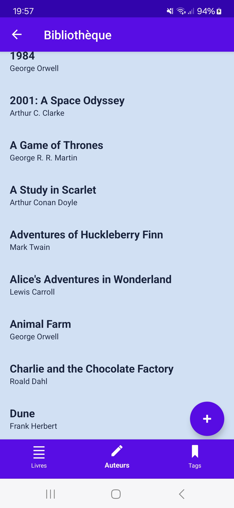
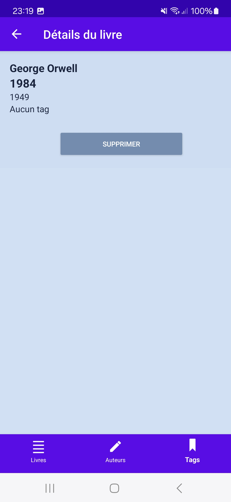
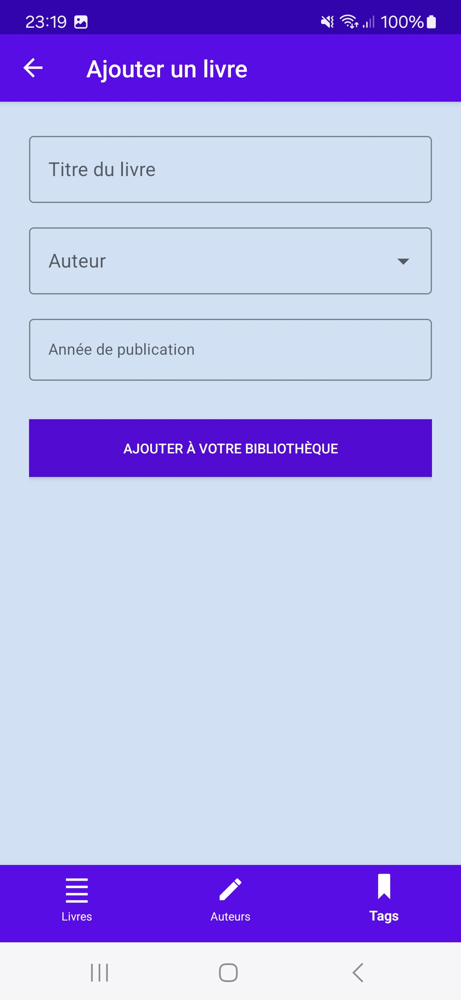
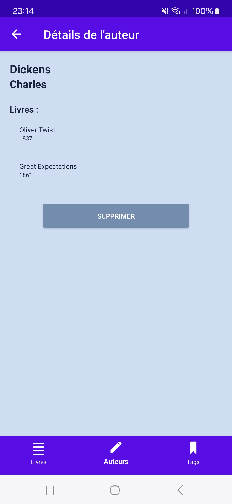
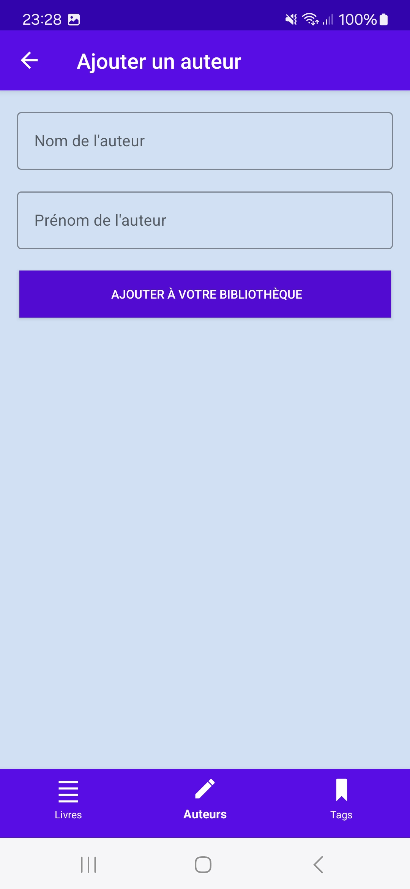
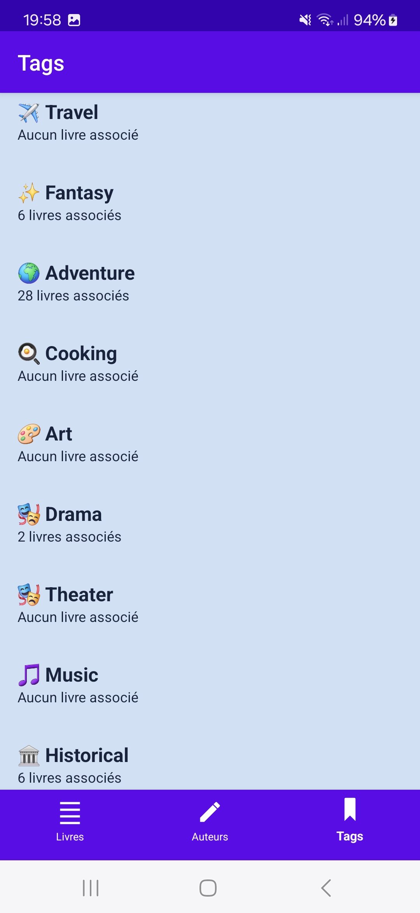

# Architecture et conception du projet

## Cahier des charges 

Nous constatons avec satisfaction que le cahier des charges est rempli. IL est détaillé ci-dessous.

### 🔧 Fonctionnalités

- [x] **Afficher la liste des livres**. Lorsqu'un livre est sélectionné, la description de ce livre doit s'afficher ;
- [x] **Afficher la liste des auteurs**. Lorsqu'un auteur est sélectionné, la liste des titres des livres qu'il a écrit doit s'afficher. Un clic sur l'un des livres doit afficher ses détails ;
- [x] **Créer un livre** à partir d'un formulaire ;
- [x] **Supprimer un livre** depuis sa page de description ;
- [x] **Créer un auteur** à partir d'un formulaire ;
- [x] **Supprimer un auteur** (et les livres associés) depuis sa page de description.
- [x] _Bonus :_ **Afficher la liste des tags** dans le troisième volet, chacun précédé d'un emodji et accompagné du nombre de livres associés.
- [ ] _Bonus :_ L'application peut permettre d'**associer une couverture à un livre**, mais uniquement localement. L'image est stockée sur le téléphone, pas sur le serveur.

### 📚 Interface

      

- [x] L'application est composée d'**une seule activité principale**. Cette activité contiendra une **[`Bottom Navigation Activity`](https://developer.android.com/studio/projects/templates#BottomNavActivity)** avec deux menus proposants respectivement la liste des livres et la liste des auteurs ;
- [x] L'écran d'accueil de l'application affiche la liste des livres ;
- [x] Les listes des livres et des auteurs sont affichées dans des **`RecyclerView`** ;
- [x] Lors d'un **clic sur un livre**, ses informations sont affichées dans un nouveau fragment ; 
- [x] Lors d'un **clic sur un auteur**, les livres de cet auteur sont affichés dans un nouveau fragment ; 
- [x] La **création des livres et des auteurs** doit être proposée à partir de [FABs](https://developer.android.com/develop/ui/views/components/floating-action-button) présents respectivement sur la liste des livres et des auteurs.

### 📐 Architecture

- [x] Mettre en place l'architecture moderne en MVVM, basée sur les _ViewModels_ pour les données et un "repository" pour centraliser les requêtes à effectuer avec Retrofit.

## Choix principaux

- L'architecture du projet est bien MVVM, classes séparées selon leur rôle dans les répertoires suivants :
  - `data/`, qui contient un repository ;
  - `model/` : les trois types d'objets que nous manipulons, les auteurs, les livres et les tags ;
  - `network/` pour mettre en place la connexion sur l'API ;
  - `ui/` subdivisé en :
    - `adapters/`, préparant des données pour chaque type d'affichage, en lien avec un modèle spécifique ;
    - `authors/`, regroupant les fragments des auteurs et leur _ViewModel_ ;
    - `books/`, regroupant les fragments des livres et leur _ViewModel_ ;
    - `tags/` (fragment et son _ViewModel_).
- Partis d'une architecture en partie déjà en place dans un projet Adnroid Studio avec barre de navigation, nous avons rapidemnent constaté que nous n'avions pas besoin d'un _ViewModel_ par fragment. En revanche, avoir plusieurs _Adapters_ pourrait être intéressant, car les livres, par exemple, sont affichés de plusiurs manières différentes, et donc avec des layouts spécifiques.

## Choix subsidiaires et compléments

- Plutôt que de charger d'office la liste des livres sur l'écran d'accueil, nous avons décidé de le faire au clic sur un bouton, par souci d'ergonomie.
- Une liste de tags est également proposée, agrémentée d'un emodji et du nombre de livres associés à ce tags. Ce serait intéressant non seulement de les compter, mais aussi de les afficher.
- Bien que ce ne soit pas une fin en soi dans le cadre de ce module, mais nous nous sommes efforcés à arrêter et à respecter une charte graphique, tout au long du processus de développement, et à créer une interface agréable à utiliser. Cela nous aura permis de découvrir des composants que nous ignorions, même si tout n'a pas été retenu dans la version finale.

## Défauts et pistes d'amélioration

- Nous n'avons pas évité la tentation Shadok d'un code compliqué, alors qu'on pouvait en faire un plus simple. Le pire, c'est que cela ne nous a pas forcément permis de mettre en place de nouvelles fonctionnalités, bien au contraire : cela nous a freiné. Si bien que peu avant la fin du projet, nous avons décidé de tout réécrire dans la partie _Book_, un peu moins dans la partie _Author_.
  - L'urgence de cette situation était aggravée par des conflits sur le dépôt, réglés.
- Nous avons perdu un certain temps à essayer de mettre en place un ajout de livres avec leurs tags, oubliant que dans l'API les tags venaient se greffer sur un livre déjà existant.
  - Nous avons même mis en place un affichage d'un nuage de tags (avec `Chip`), cliquables et disposables, dans le fragmeent d'ajout d'un livre :
 
  
  
  - Il faudrait par ailleurs rendre cette fonctionnalité possible : attribuer un ou plusieurs tags à un livre qu'on vient de créer.
- Nous avons eu quelques soucis avec la barre de navigation, couplée à d'autres composants (FABs, images...). Ces problèmes ont été réglés, mais il en reste une trace pour l'instant indélébile : un vide au-dessus de la liste des livres ou des auteurs, mais seulement à la première ouverture. Il faudrait, sans doute, ajuster des réglages liés aux _margins_ dans le layout de la liste des livres aussi bien que dans le layout de l'activité principale.
- IL nous arrivait de générer des erreurs simplement en mélangeant deux conventions de nommage, _camelCase_ et snake_case_ (`publicationYear` vs `publication_year`...).
- Nous aurions dû relire plus attentivement les spécifications de l'API avant de nous lancer dans le développement, cela nous aurait fait gagner du temps.